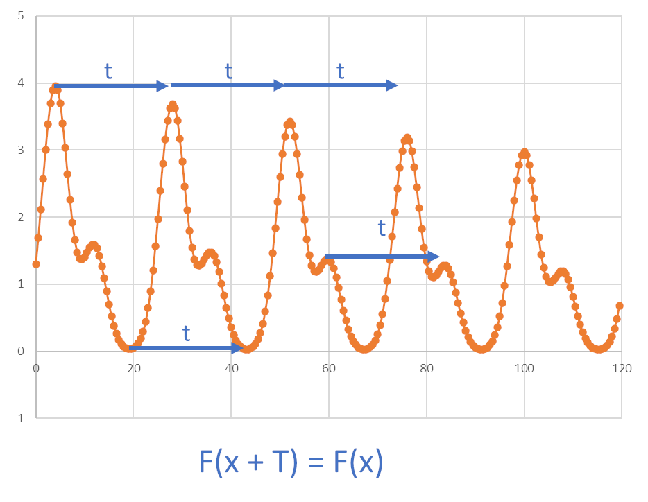
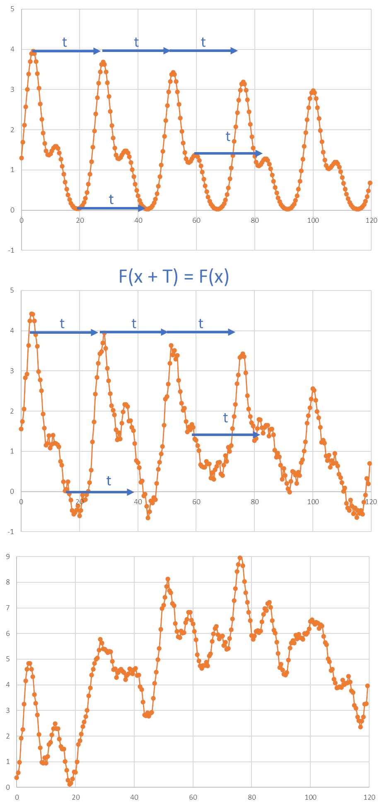
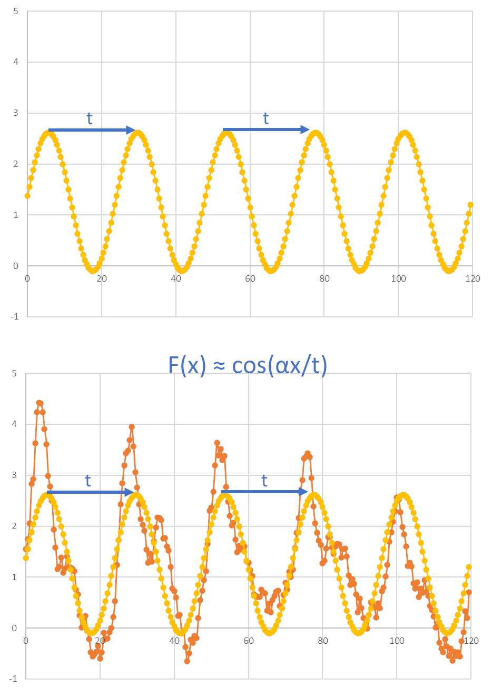
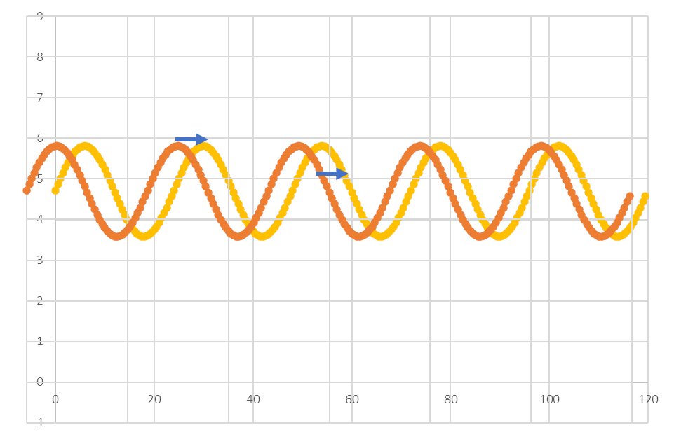
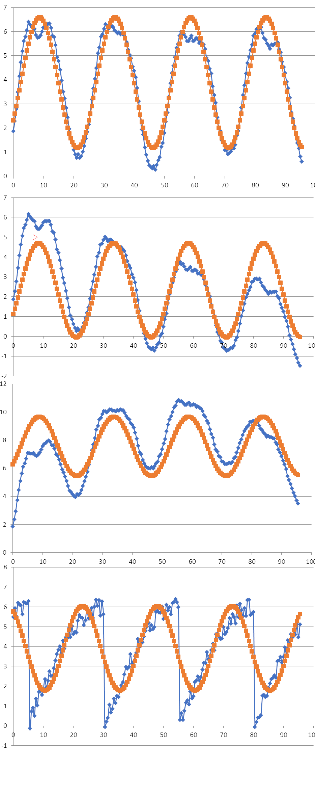

Period analysis and rhythmicity tests are techniques used in the analysis of circadian time
series data, which are measurements taken over time that reflect the cyclical nature of 
biological processes occurring roughly every 24 hours.

**Period Analysis**: This involves identifying the dominant periodic components within a time 
series dataset. It aims to determine the length of the repeating cycle (period) and the 
amplitude of the oscillations. 

**Rhythmicity Tests**: Rhythmicity tests assess whether a time series dataset exhibits 
statistically significant rhythmic patterns. These tests evaluate whether the observed 
fluctuations in the data are likely to occur due to chance or if they represent true circadian 
rhythms. Various statistical tests can be used for this purpose, these tests assess the 
presence of rhythmicity by comparing the observed data to the expected pattern under the null 
hypothesis of no rhythmicity.

Both period analysis and rhythmicity tests are essential tools in chronobiology for 
understanding the circadian rhythms of biological systems, including sleep-wake cycles, 
hormone secretion, and gene expression patterns. They provide insights into the underlying 
temporal dynamics of these processes and help researchers characterize their rhythmic 
properties. 

## Period

The function `F(x)` exhibits periodic behavior with a period `T` if, for any value of `x`, the value of the function repeats itself after adding `T` to `x`. In other words, the function repeats its values every `T` units along the xx-axis.

~~~
F(x) = F(x) + T
~~~

Figure 1. Periodic function

Real biological data are rarely perfectly represented by mathematical curves. Time series data, which are measurements taken over time to depict cyclical biological processes such as circadian rhythms, often contain noise, damping effects, or underlying trends (Figure 2). 

  
Figure 2. The real biological data typically contains noise as well as trends

In the context of time series data and circadian rhythms, a period refers 
to the length of time it takes for a repeating pattern or cycle to occur. Specifically, it 
represents the duration of one complete oscillation or cycle in a cyclical phenomenon. For 
circadian rhythms, which have a roughly 24-hour period, the period refers to the time it takes 
for the rhythm to complete one full cycle, typically from one peak (or trough) to the next 
peak (or trough).

In order to characterize the data with period/phase/amplitude we model the observed signal as known mathematical function of periodic properties, typically cosine. 

  
Figure 3. Modelling data with a periodic function

## Curve fitting

Curve fitting, also known as regression analysis, is a statistical technique used to find the best-fitting curve or function that describes the relationship between variables in a dataset.
The goal of curve fitting is to identify the mathematical model that most accurately represents the pattern or trend observed in the data.

The first step is to choose a mathematical model or equation that is believed to represent the relationship between the variables in the dataset. Common models include linear or
polynomial for trends and sinusoidal functions for oscillations.

Once a model is selected, the next step is to estimate the parameters of the model that best fit the data. These parameters are the coefficients or constants in the mathematical equation that determine the shape and position of the curve.

For trends it will be the slope `a`and intercept `b` in the trend `y = ax + b`

For cosine it will be its period, phase and amplitude:

`f(x)=A cos(2π/T * ​(x−P))` where T is period, P is phase and A amplitude.

Curve fitting aims to minimize the difference between the observed data points 
and the values predicted by the model. This is typically done by minimizing a 
measure of the residuals, such as the sum of squared differences between the 
observed and predicted values (least squares method).

It turns out that all *"decent"* functions (signals) can be reconstructed as a sum of various cosine components of different phase, period and amplitude.
While the exact reconstruction may involve a very large number of components (in theory indefinite), using only 5 cosine components we can obtain quite complex shapes (Figure 4). 

 
Figure 4. Modelling data as a sum of cosines.

We select properties of the either:
- the *main* consine component i.e. with a larger amplitude
- the *circadian* component, i.e. with period within sensible range (for example 20-28 hours)

## Phase

In circadian data analysis, the phase typically refers to the timing or position of a specific event or feature within the circadian cycle. It indicates where in the cycle a particular biological process or rhythm reaches a certain point, such as a peak, trough, or critical transition.

In the context of a cosine function, the phase represents the horizontal shift (to the right or left) of the cosine curve along the x-axis.

For a standard cosine function f(x)=cos⁡(x), the phase is typically considered to be zero, meaning the curve starts at its maximum value at x=0 and proceeds from there.

However, in the more general form of a cosine function with a phase shift, represented by  
`f(x) = A * cos(2π/T * (x - P))`  
the phase shift P determines where along the x-axis the cosine curve starts.

If P>0, the curve is shifted to the right, meaning it starts its oscillation later than the standard cosine function.

If P<0, the curve is shifted to the left, meaning it starts its oscillation earlier than the standard cosine function.

  
Figure 5. Phase shift of cosine

For biological data we do not know the "original" shape which is being shifted py a phase. So we do a mental jump and use a marker positions (for example peak) relative to a reference point (for example dawn). 

  
Figure 6. Phase shift of unknown function

In practice we could use following metrics to define phase

- position of the first peak in the original data
- position of the first peak in the smoothed data (better)
- circular average position of peaks (we need to know the period of the signal, to get peaks in each period-wide window) 
- we can fit a cosine function and use its phase

  
Figure 7. Phase by fitting cosine

As can be seen in the bottom graph of Figure 7, the cosine fit is not a perfect introduces bias if the signal is not symmetrical, in the sense that it does not coincide with the peak time. 

Finally, in the circadian field we may prefer using other measures, like onset/offset of activity to define the daily timing of the events (Figure 8).

  
Figure 8. Onset of activity. Credit [http://dx.doi.org/10.3791/2463](http://dx.doi.org/10.3791/2463)

## I am a section

With a text.

*After [Figure source](https://www.figure.link/)*

> ## I am a yellow info
>
> And my text.
{: .callout}

~~~
I am code
~~~
{: .source}

> ## I am a problem
>
> Defined here.
>
>> ## Solution
>>
>> *   I am an answer.
>> *   So am I.
> {: .solution}
{: .challenge}

> ## Attribution
> Content of this episode was adopted after XXX et al.
> [YYY](https://biodare2.ed.ac.uk).
{: .callout}


